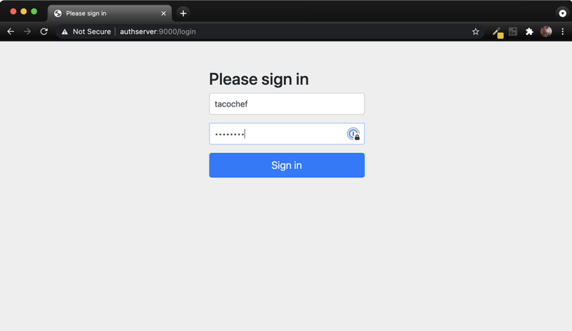
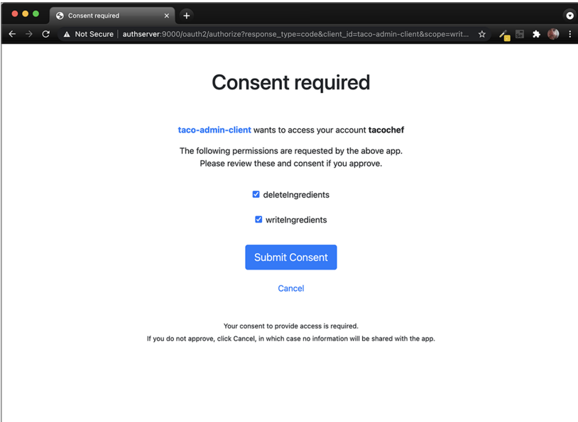

# Taco Cloud — Chapter 8: OAuth2 Authorization Flow (Consolidated Setup)

This module demonstrates key concepts from Chapter 8 of *Spring in Action*, covering:

- **8.2 OAuth2 Authorization Code Flow**
- **8.3 Resource Server Configuration**
- **8.4 Client Application Integration**

Unlike the book, where each server (authorization, resource, client) is run separately, 
this module combines them using Docker Compose. 
All three parts are containerized and run together with startup coordination via `wait-for-it.sh`.

### 📚 Related Modules Based on the Book

This Docker-based implementation combines all three components (Authorization Server, Resource Server, and Client App) into a unified environment for convenience.

If you want to explore each part independently as described in *Spring in Action*, see the following modules:

- [`chap8-authorization-server`](../chap8-authorization-server): Standalone OAuth2 authorization server
- [`chap8-client-app`](../chap8-client-app): Client application interacting with both auth and resource servers
- [`chap8-resource-server`](../chap8-resource-server): Resource server exposing protected endpoints


## Module Structure

- `auth-server` – Handles OAuth2 authorization and token issuance.
- `resource-server` – Provides protected REST endpoints for authenticated users.
- `client-app` – The web client that authenticates via the auth server and consumes the resource server.

> **Note:** Token acquisition, consent, and access happen internally inside the Docker network. You only interact with the web client on `localhost:9090`.

## 🐳 Run the Application in Docker

### 📦 Prerequisites

- Docker & Docker Compose installed
- Port 9090 (client), 8080 (resource), and 9000 (auth) are free

### 🚀 Launch

```bash
    cd ./chap8-auth-resource-client
    docker-compose up --build
```

### 🛑 Stop & Clean Up

```bash
    docker-compose down
```

---

## 🔐 Login Flow Preview

1. **Sign In with OAuth2 Authorization Server**

    

2. **Grant Permissions (Scopes) via Consent Page**

    

These steps simulate a secure real-world OAuth2 login and consent process, including scopes like:
- `writeIngredients`
- `deleteIngredients`

---

## 👤 Sample Credentials

You can log in using one of the preconfigured users:

| Username    | Password   |
|-------------|------------|
| `habuma`    | password   |
| `tacochef`  | password   |

---

## ⚙️ Implementation Notes

- The project uses **Spring Security 6+**, **OAuth2 Authorization Server**, and **Resource Server**.
- The `client-app` initiates the authorization code grant flow.
- **All tokens and redirects stay inside the Docker network**; the user only sees login/consent and final client content.
- `wait-for-it.sh` scripts ensure the servers start in the proper order.

---

